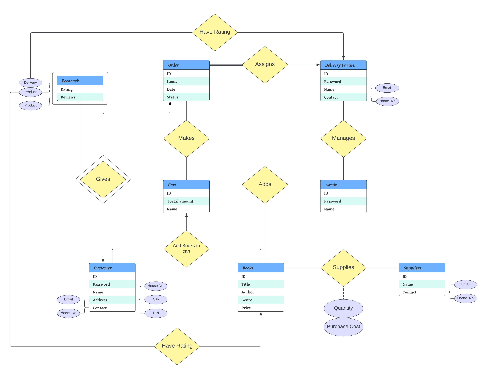

# ReadIt

# Introduction 📖

ReadIt is a practical online book retail platform, serving as our database management system project. Specifically designed for users, including customers, authors, publishers, and administrators, ReadIt focuses on simplicity and functionality. The platform features a straightforward interface, allowing users to perform essential actions like account creation, login, book exploration, adding to a virtual cart, and placing orders with ease.

# General Features 🖥️

-   **Sign Up**

ReadIt allows users to sign up for an account on the platform. This process is easy. Customers need to select the type of account they want to create, such as customer, delivery partner, or seller, and fill in their personal details for signing up.

-   **Login**

Once the user has signed up, they can log in to their account to access the platform's features. The application offers different login options for customers, delivery partners, and administrators, depending on their account type.

# StakeHolders

## Customers 🧑🏻‍🏫

Individuals who will interact with the system

-   **View Products:**

Customers can browse and view the products available on the platform. They can `sort products` by Genre, such as Fiction, Non Fiction, Children, Study etc. They can also `filter Books` by price, languages and Bindings.

-   **Add to Cart:**

Customers can add products to their cart, view the products they have added and change their orders as required to buy them later. The application stores their cart data, so they can return and complete their order later. They can also remove items from their cart if they change their minds.

-   **Place and Track Order:**

Users can place orders using their cart. Customers can then track the status of their orders on the platform. They can see the current status of the order, such as order placed, order shipped, or order delivered.

-   **View Order History:**

Customers can view their past order details on the platform. They can see the details of their past orders, such as the products ordered, their `quantity`, the `order_date`, the `order_status`, the `order_value` and more.

-   **View Transaction History:**

Customers can view their payment history on the platform. They can see the details of their past payments, such as the `payment method` , the `amount paid`, the `date of payment` and more.

-   **View Account History:**

Users can view their account details on the platform. They can see their personal information, such as their `name`, `email_address`, `phone_number`, `shipping_address`, etc. They can also update their account information if required.

-   **Rating and Reviews:**

Users can give feedback by `rating delivery partner, products` and contacting customer support in case of any grievances or issues.

## Administrator 👨‍✈️

Responsible for designing, implementing, and maintaining the Inventory of our store.

-   **Number of Orders Placed by Each Customer and Total Orders:**

This feature allows administrators to see the total number of orders placed by each customer and the total number of orders on the platform.

-   **Sales Revenue for each Category with Total Revenue:**

Administrators can view the total revenue generated by each product category and the total revenue of the platform.

-   **Total Number of Orders completed by each delivery partner and the Total Number of Orders Completed**

This feature allows administrators to view the total number of orders completed by each delivery partner and the total number of orders on the platform.

-   **Number of Products in each Category and the total number of Products:**

Administrators can view the number of products available in each category and the total number of products on the platform.

-   **Add a Category / Product:**

Admin can add new product categories to their platform to offer more options to customers.

-   **Delete a Category / Product**

Remove individual products or entire product categories from the platform if we no longer sell them or not in our inventory. This transaction deletes the product from the `cart`, `products` and `inventory` tables.

## Delivery Partners 🛵

Individuals responsible for delivering the physical books to customers.
They are given a rating on our application. He/she can view that rating and its current salary.  
Features apart from this includes

-   **View Delivery History:**

Delivery partners can view their delivery history on the platform. They can see the details of their past deliveries, such as the order details, the date of delivery, the customer details, and more.

-   **Current Orders:**

Delivery Partners can see the `order_id` of the orders assigned to it currently.

-   **See Items Present in an Order:**

Upon entering the `order_id`, the delivery partner can see the list of items to be picked up for that order.

-   **Deliver an Order:**

Delivery partners can mark an order as delivered once it is delivered to the customer. The customer will be notified about the delivery, and the order_status will be updated on the Database.

## Suppliers 📦

Publishers/Distributors/Wholesalers involved in providing the inventory of books to our online store. They are critical for maintaining a diverse and updated collection of books.

# Entity Relationship Model

Thank you for choosing ReadIt, and we look forward to serving you soon!
